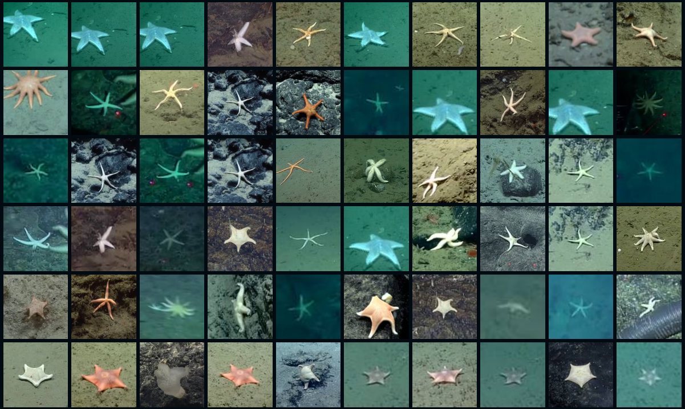
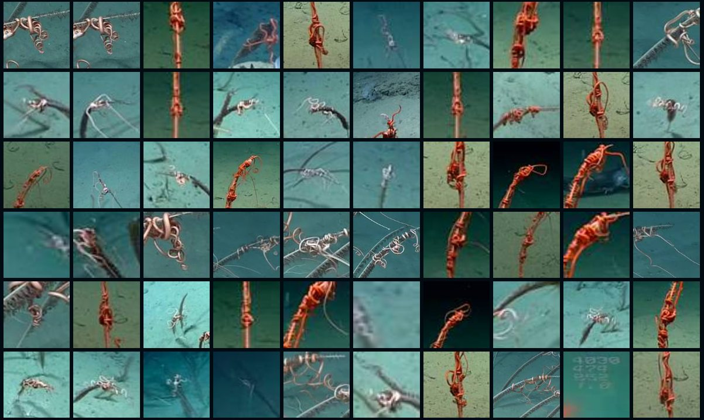
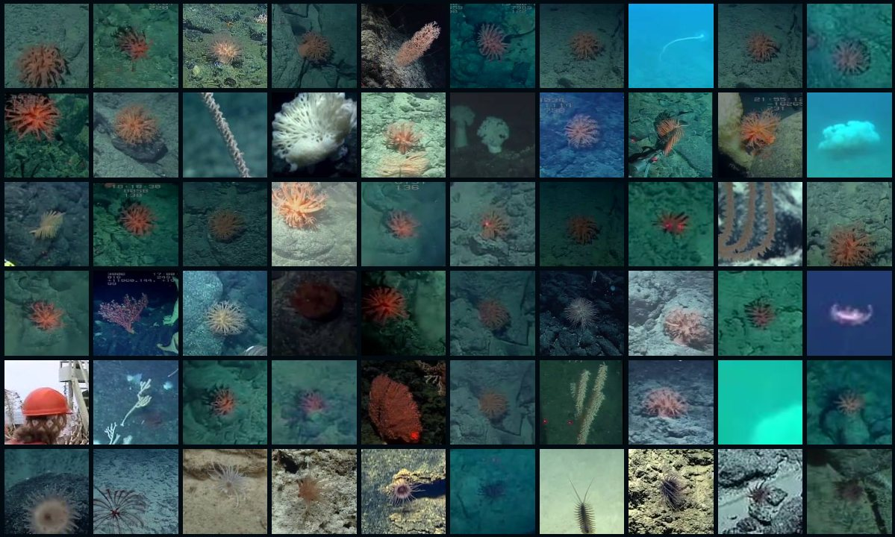

# PixelPatrol Deep-Sea (`pixel-patrol-deepsea`)

A prototype. It reads published deep-sea dive video — NOAA Ocean Exploration's tapes,
MBARI's annotated [DeepSea-MOT](https://huggingface.co/datasets/MBARI-org/DeepSea-MOT)
sequences, the cabled camera at Axial Seamount — measures what moved in every slice,
runs an object detector over a frame a second, and puts the result on one page that can
be searched.

Seventeen expeditions, 274 hours, 2000 to 2026. Nothing is copied: every recording is read
from the archive that published it, and the collection page opens the archive's own file at
the second an animal was found.

It is an extension for [PixelPatrol](https://github.com/ida-mdc/pixel-patrol). If you
want to run it, extend it or read how any of it works, that is
[`docs/DEVELOPING.md`](docs/DEVELOPING.md).

## The collection page

**[https://ida-mdc.github.io/pixel-patrol-deepsea/](https://ida-mdc.github.io/pixel-patrol-deepsea/)**

Every animal the detector found, arranged by the ranks the World Register of Marine
Species puts above the names it used. Picking a name, or clicking into the rings, fills
the wall with the sightings of it, most confident first. Hovering a tile plays the seconds
around that animal; clicking it opens the archive's own recording at that moment with the
detector's box drawn over the frame.

One name, one page of its wall:

| | |
| --- | --- |
|  |  |

### Disclaimer

The classification is a [FathomNet](https://fathomnet.org)-trained YOLOv5 checkpoint —
499 classes, trained on MBARI imagery, run over one frame a second of footage it was not
trained on. The ranks above those names come from the
[World Register of Marine Species](https://www.marinespecies.org/); the names themselves
come from the model.

- A name on the page is that model's output for a single frame. It is not an
  identification.
- Counts are upper bounds. One animal crossing several slices can be counted more than
  once.
- Coverage is a sample: 1,811 recordings of the 18,301 these expeditions publish, taking
  the deepest dives first and sampling within their bottom time.
- Nothing is manually curated. No sighting has been verified or corrected one by one.
- Measured against the one benchmark here with a box around every animal, the detector
  finds 0.68 of them at 0.91 precision — see [Does it work](#does-it-work) for the rest
  of that, including where it is confidently wrong.

Every sighting has a permanent link. Starred sightings export as CSV with the recording,
the timecode and the box.

## What it measures

Every recording is cut into slices of a second or so, and each slice gets:

- **How much the picture changed** between consecutive frames — the signal that
  separates a held shot, a transit and duplicated tape.
- **What moved independently of the camera**, by background subtraction with no model
  and no class list, as a count and as a share of the frame. This is the only measure
  here that can flag an animal no detector has a category for. It also reports how fast
  the camera itself was moving: a vehicle holding station is usually looking at something.
- **Which animals a detector named**, how sure it was, and a crop of each. The detector
  is optional; without it everything else still runs.
- **What colour the slice is**, as a mean and as a distribution — a kilometre of water
  takes the red out of everything, so this is largely how close and how lit the subject
  was.
- **Where and when it was filmed**, from the dive's own navigation: position, depth,
  height off the bottom, and the UTC clock the archive published.
- **A small JPEG of the slice**, so the report can be read with no access to the footage.

There is one more measurement the package can make and this collection has not: a count
of small bright particles per frame. In midwater those are largely the animals; near a lit
seafloor they are marine snow and the measure inverts. It needs a re-analysis to turn on.

Three passes then run over the finished report, reading no footage: detections are linked
into individual animals, every slice is judged for what the footage was doing (frozen,
subject, unnamed, dwell, empty, active), and the pictures a report holds twice are dropped.

## What comes out

**A report per expedition**, opened in a static viewer with six widgets in three groups:

| | |
| --- | --- |
| *Footage quality and coverage* | what the footage is doing, per recording and along one recording's length |
| *What was found* | a gallery of ranked sightings, and the names arranged by taxonomic rank |
| *Where and when* | a depth profile per dive, and sightings on the archive's clock |

**And the collection page** above them, which is the picture at the top of this file.

## Does it work

End to end over MBARI's five annotated sequences — 4,433 detections against 5,878
annotated animals:

| | precision | recall |
| --- | --- | --- |
| everything in the report | 0.91 | 0.68 |
| at the viewer's default floor of 0.06 | 0.97 | 0.62 |
| at a floor of 0.37 | 0.99 | 0.43 |

Two things to read alongside that:

**The precision is a floor, not a figure.** The most confident detections with no
annotation under them turn out, cropped and looked at, to be real sea pens and shrimp the
benchmark does not label — it tracks a chosen set of animals rather than claiming nothing
else is in frame.

**A confident name is not a correct name.** Against five midwater clips named after the
specimen in them, the detector was right on two: correct where the animal is in its
vocabulary, and wrong at 0.94 on both siphonophores and on a lobate ctenophore, reaching
for `trachylinae` each time. Confidence ranks what to look at, not what it is, which is
why every name this package writes says it is a guess.

`collect score` re-measures all of it against whatever ground truth an expedition has.

## Licence

MIT. The footage is not ours: NOAA's is public domain, MBARI's DeepSea-MOT is CC BY-SA
4.0, and the observatory's is open with a required acknowledgement. Every picture on the
collection page says which.
